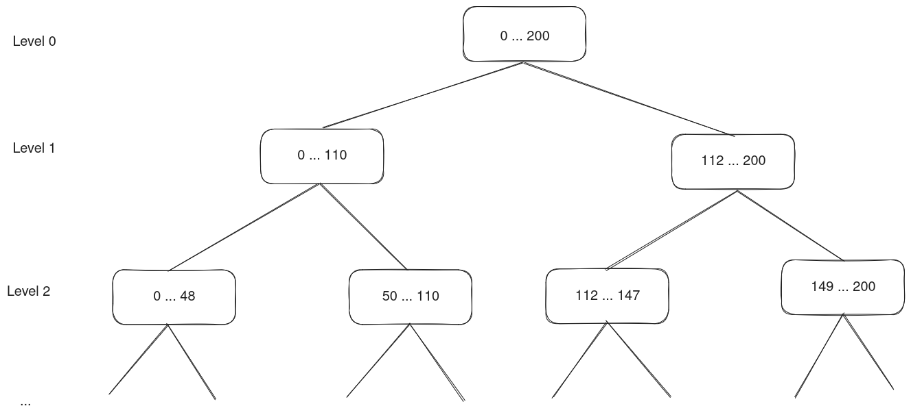

Algorithms
----------

The first step towards writing efficient code is to start from a good algorithm. It is also where
the most dramatic performance improvements can be found.

Sometimes good 
algorithms are available in libraries and the only thing one needs to do is to call them. But when
you write code to solve a new problem, or an old problem in a new way, you are on your own.

Hence this chapter of the lesson is about algorithms, or rather about algorithmic patterns.

.. tip::

   We will be measuring execution time in this and later parts. There are a few pitfalls
   that one should be aware of.
   
   - Run your measurements on an unloaded system. Even if you have a multicore, there
     are many resources that are shared between the cores, including the memory interface.
     One perhaps surprising example is the power envelope; often clock frequency can be
     raised if only one core is active.
     
     If you are following this workshop online, you are probably running a 
     videoconferencing system in the background. That is very likely to affect
     any measurements you make.
  
   - Do not measure too short times. There is always some overhead. There is also the case that
     while the processor is not too busy, it runs with a reduced clock frequency,
     and it may take a little time before the clock frequency is increased. 
     A good idea is to want to run for at least a quarter of a second or so. 
   
   - Do not make a longer time to measure by using a loop in a shell script, or
     similar. Your program will be started many times, and that overhead may become
     a large part of the time you measure.

.. tip::

   You can find the files used in this section
   `here <https://github.com/ENCCS/performance-programming/blob/main/algorithm-files.zip>`_ as
   a zip archive. Follow the link, click on "View raw" and you will get it downloaded.
   Move or copy it to where you want it, then unpack it like this:
   
   .. code-block:: bash
   
      unzip algorithm-files.zip

Complexity
^^^^^^^^^^

Algorithms are often categorized by their *complexity*, meaning their execution time as a function of
the size of the input. Since the actual running time varies between systems, the execution time we use
in this context is the number of steps that an idealized (model of a) computer called a Random Access Machine,
or *RAM*, would need. Input sizes are measured in different ways for different algorithms.

.. admonition:: Example

  For a naive
  simulation of gravitational attraction between a large number of stars, the size of the problem is typically
  the number of stars. Since every star is attracted by every other star, the work for a single time
  step of the simulation is proportional to the square of the number of stars.

  As an alternative, one could imagine doing the force calculation by dividing space into a number of fixed
  size cells and compute the force on each star by considering the mass of stars in each cell. The cost of
  doing that for one star would be proportional to the number of cells, thus the size and the granularity
  of the simulated space becomes part of the size of the problem for this alternative approach.

  .. Later, we will encounter the Barnes-Hut algorithm which combines these two approaches in a clever way.

Actual computers differ from the RAM and from each other in many details, and these have important
consequences for performance, as we will see later. However, almost always the difference
can be expressed as a constant multiplicative factor. That is, one machine is about :math:`X` times faster than
another independent of the size of the input.

Thus, when we discuss the complexity of an algorithm, we are not interested in absolute performance
but rather in how the execution time changes when the size of the input changes. This is typically expressed using
the "big O" notation; we write that the naive gravity simulation algorithm above is :math:`O(n^2)` to mean that
for large enough :math:`n` there is a constant :math:`c` such that the algorithm uses at most :math:`cn^2` steps
on a RAM to solve a problem of size :math:`n`. The "large enough" provisio captures the fact that we are interested
in what happens "in the limit". Technically, it for instance allows us to amortize
any fixed cost initialization over the entire computation.

Quadratic algorithms and hash tables
^^^^^^^^^^^^^^^^^^^^^^^^^^^^^^^^^^^^

Consider the problem of determining if the elements of an array of interǵers are all unique. Here is a simple
version that compares all pairs of elements:

.. code-block:: C

  int unique1(int a[], int n) {
    for(int i = 0; i < n; i++)
      for(int j = 0; j < n; j++)
        if(i != j && a[i] == a[j]) return 0;
    return 1;
  }

Complexity is quadratic (:math:`n^2`) due to the nested loops. Some of the computation is clearly redundant,
each pair (x,y) of distict indices is checked twice, once when `i==x` and `j==y` and once when `i==y`
and `j==x`. So the first improvement is to remove this simple redundancy:

.. code-block:: C

  int unique2(int a[], int n) {
    for(int i = 0; i < n-1; i++)
      for(int j = i+1; j < n; j++)
        if(a[i] == a[j]) return 0;
    return 1
  }

Here we insist that `i<j` at all times so we check each (x,y) pair only once and also at the same time
we avoid the test ensuring that `i != j`. Can we do better? Yes, by sorting the array first. Sorting
can be accomplished in time :math:`O(n \log(n))` which is much faster than :math:`O(n^2)`. Having sorted the
array, equal elements are now adjacent.

.. code-block:: C

  int unique3(int a[], int n) {
    sort(a, n);
    for(int i = 1; i < n; i++ ) {
      if(a[i-1] == a[i]) return 0;
    }
    return 1;
  }

Here we helped ourselves to a function ``sort()`` that sorts an array of ``int``. There are interesting lessons
to learn from implementing that function, and we will return to these later.

What is the complexity of ``unique3()``? The function first sorts the array, then traverses it linearly in a single
pass, a process that is clearly :math:`O(n)`. If the algorithm used by ``sort()`` is :math:`O(n\log(n))`, this means
that the entire algorithm is :math:`O(n\log(n))` since this is asymptotically greater. There is no constant :math:`c`
such that :math:`cn > n\log(n)` for large :math:`n`.

Is there a way to solve this problem even faster? There is at least one variation that is likely to be faster in many
cases, and that involves using a *hash table*. This is a data structure that can be used to implement a set with fast
insert, delete, and membership test (in general, a hash table can implement a finite map from a set of *keys* to a set of
arbitrary values). If the keys are small enough integers, we do not need a hash table and can just use an array. 

The new version iterates over the integers in the array one by one, looks up each one in the hash table and inserts it if
it was not there.

.. code-block:: C

  int unique4(int a[], int n) {
    ht_t h = new_hash_table(n);
    for(int i = 0; i < n; i++ ) {
      if(member(h, a[i])) return 0;
      insert(h, a[i]);
    }
    delete_hash_table(h);
    return 1;
  }
    
A hash table is implemented as an array that is indexed using a value computed from the key using a *hash function*.
The hash value must be a valid index into the table, so if the size of the table is
:math:`s` then the hash value :math:`v` must satisfy :math:`0 \leq v < s`.

Each entry in the hash table collects those keys that are mapped to that entry's index by the hash function.
When checking if a particular key *k* is present, all of the keys in the hash table entry must be compared
to *k*. Clearly, performance will be best if each table entry contains at most one key. In that case, there will only
be one comparison computed for each access.

Whether a particular hash function is good or not depends on the distribution of keys that we want to keep in the
hash table at the same time, which is application dependent.

.. In general, we compute a hash value in two steps. First we compute an integer :math:`k` from the
   object we want to insert. In this example, we already have an integer, so this this
   step becomes trivial. Second, we limit the size by for instance taking the modulus
   with respect to the table size :math:`s` of :math:`k` to get a valid index.

.. admonition:: Uses of hash tables

   Hash tables are useful in several high performance computing domains:

   Genomic Data Processing
     In bioinformatics, hash tables are often used to store and quickly retrieve genomic data. For example, 
     they can be used to store k-mers (subsequences of length k) in DNA sequence analysis or genome assembly tasks.

   Graph Analytics
     In graph analytics, hash tables can be used to represent sparse adjacency matrices or edge lists, allowing 
     for efficient access and manipulation of graph data.

   Particle Simulations
     In particle simulations (like molecular dynamics), hash tables can be used to efficiently keep track of
     particles in a given spatial region. This is particularly useful when particles only interact with very
     nearby particles. Then space can be divided into a grid of cells. If most cells are empty, a hash table
     where the key is the cell coordinates can be a good representation.
  
  .. This is particularly useful in methods like the Fast Multipole Method 
     (FMM) or Particle Mesh Ewald (PME) method, where the computational domain is often divided into a grid, and 
     each cell in the grid maintains a list of particles it contains.

   In addition, hash tables are a staple of operating systems, compilers, and database systems.

Divide and conquer, sorting and randomness
^^^^^^^^^^^^^^^^^^^^^^^^^^^^^^^^^^^^^^^^^^

Above, we used sorting to improve the performance of the ``unique`` function. Here we
will take a look at how a sort function can be implemented. This will illustrate 
some additional points about algorithm design.

Below is an old and famous sorting algorithm known as Quicksort. It is an example of
a recursive *divide and conquer* algorithm. The idea of this class of algorithm is to
to divide a problem into smaller sub problems, solve the sub problems, and combine
the solutions. For this scheme to work, small enough sub problems must be solved by
another method or be trivial. For the case of sorting, an array with less than two 
elements is trivially sorted.

Thus, in a divide and conquer algorithm, the meat is in dividing the original 
problem into two (or sometimes more) sub problems and then combining the results.
Either of these steps, but not both, can be trivial (well, if both are trivial, you 
are *very* lucky).

.. literalinclude:: quicksort.c
   :language: C
   :linenos:

We can visualize the execution of this algorithm as a call tree where each node
corresponds to one call to ``quicksort``. The root is the call in the
``main`` function which passes an array with 201 numbers. That array is then
split in a lower and an upper part. Note that the numbers in the figure represent
indices, places in the array, rather than the numbers in it.

   The call tree of ``quicksort``

As you can see, the tree is not perfectly balanced; the largest child will 
process somewhat more than half of the data of its parent. If the division was
perfect, the depth of the tree would be the base 2 logarithm of the number
of elements in the array to be sorted. Now it will be somewhat larger, but not
more than :math:`1.4 \log_2(n)` on average.

As you can see in the figure, each layer of the call tree processes approximately
:math:`n` numbers (pivots at upper levels are skipped). Hence the expected
performance is roughly :math:`1.4n\log_2(n)`.

But how fast is that in practice?

.. exercise::

   Explore the performance of ``quicksort``! You can build the program with the
   following command:
   
   .. code-block:: bash
   
      gcc -O3 -o quicksort quicksort.c qmain.c
   
   This will give you an executable program that you can run as follows:
   
   .. code-block:: bash
   
      ./quicksort 1000
   
   The argument tells the main program how many numbers to have in the array to
   sort. The numbers will be initialized randomly.
   
   You can get the execution time from the ``time`` command, as follows:

   .. code-block:: bash
   
      time -p ./quicksort 1000
   
   Try out some different sizes!
   
.. solution::

   Here are the results from the Core i7-8550U as well as a linear function
   fitted to the smaller sizes (left part of plot).
   
   .. image:: quicksort-time.png

   We see that for large :math:`N`, :math:`N \log(N)` is pretty linear, although
   the constant is rather large; 96ns corresponds to some 350 clock cycles. But
   that must be amortized over some 30-ish levels in the tree. This gives a cost
   of just over 10 cycles per comparison, which, as we will see later, is expected.

One conclusion we can draw from our study of ``quicksort`` is that as long as
:math:`n` is the size of a data structure, that is related to memory size and not
absolutely fantastically large, :math:`\log(n)` is more or less a constant (it will
for instance hardly be larger than 40). Maybe
not a very good constant, but it is not
something that makes the complexity of a program grow without bound.

So far, we have run ``quicksort`` with randomly generated data, but what if the
data is already sorted?

.. exercise::

   Explore the performance of ``quicksort`` on sorted input. The 
   ``main`` function will initialise the array to be strictly increasing if
   you invoke the program like this:
   
   .. code-block:: bash
   
      ./quicksort seq 1000
   
   Tip: Try smaller sizes first!

.. solution::

   Here is what we get on the Core i7-8550U:
   
   .. image:: quicksort-seq-time.png
   
   This is quite a big difference to the random input case. A quadratic function
   fits very well.
   
What is happening here is that the pivot chosen always happens to be the largest
value in the range, so in each case one of the recursive calls will get everything
but the pivot wheras the other will get an empty range. Thus the depth becomes linear
rather than logarithmic and the complexity becomes quadratic.

One solution to this problem is to choose the pivot randomly. This means that
instead of running slowly on some input arrays, the algorithm runs slowly on some
random uses. Hence, whatever the input distribution, the algorithm will run 
fast on average.

.. literalinclude:: quicksort-rp.c
   :language: C
   :linenos:

Here we make a random selection unless ``n`` is so small that it does not matter
(if we would try to get a sort function that was fast in practice, we would probably
go for another algorithm, for instance selection sort, for small ``n``).

.. exercise::

   Explore the performance of ``quicksort`` with random pivoting! You can build 
   the program with the following command:
   
   .. code-block:: bash
   
      gcc -O3 -o quicksort quicksort-rp.c qmain.c
   
   This will give you an executable program that you can run as before:
   
   .. code-block:: bash
   
      ./quicksort 1000 # Randomly scrambled input
      ./quicksort seq 1000 # Ordered input
   
   Try out some different sizes, and compare scrambled and ordered input!
   
.. solution::

   Here are the results from the Core i7-8550U for both scrambeld and ordered input
   and with the original (fixed pivot) scrambled input times.
   
   .. image:: quicksort-rp-time.png

   We see that with rendom pivots, we are back to an almost linear behaviour.
   Interestingly, the case with random pivot and ordered inputs runs almost three
   times faster than the unordered input. We will come back to this when we know
   more about computer architecture.
   
   We can also see that for unordered input, the random pivot version is somewhat
   slower due to the cost of computing the random numbers.

Sparse algorithms
^^^^^^^^^^^^^^^^^
A typical situation when dealing with vectors or matrices is when one of them 
are sparse, meaning that it contains a large fraction of zeroes. An example is the 
inner product between two vectors. If calculations are executed through the usual method, 
as seen in the code below, a lot of time will be wasted in computing zeroes. 

.. code-block:: C
   :linenos:

   double traditional_ip(double *v1, double *v2, size_t size) {
   double sum = 0;
   for(size_t i = 0; i < size; i++) {
      sum += v1[i] * v2[i];
   }
   return sum;
   }

Instead, the classical examples of sparse algorithms come from linear algebra and
teach us to represent such data structures more compactly by taking advantage of
its sparseness, typically, by only representing the non zero elements.
Similarly, when computing the inner product between two vectors, if one of them is sparse, 
only the positions where that vector is nonzero need to be considered.

.. code-block:: C
   :linenos:

   typedef struct {
      double val;
      size_t index;
   } nonzero_t;
   
   double sparse_ip(nonzero_t *sv, size_t n_nonzero, double* dv) {
     double sum = 0;
     for(size_t i = 0; i < n_nonzero; i++) {
       sum += sv[i].val * dv[sv[i].index];
     }
     return sum;
   }

If more than half of the values in ``sv`` are zero, the sparse representation
will be smaller. Also, the multiplication and addition need only be performed
for the nonzero elements of ``sv``.

On the other hand, we have indirect accesses for ``dv``; rather than simply walking
through it like we would do in a dense implementation, we make random accesses 
to the elements indicated by ``sv``. Also, SIMD vectorization becomes more difficult
and less efficient.

So in practice, the trade off may well be at 80-90% zeroes rather than 50%, but 
that depends on details of algorithms and hardware.

.. exercise::
   The code dotproduct.c includes both the method above as well as a direct method
   for calculating dot products. Explore and compare their performance!

      .. code-block:: bash
         gcc -O3 -o dotproduct dotproduct.c

   To use, you can use the parameters such as vector size, method (sparse, traditional), and degree of sparsity (from 0 to 1).

      .. code-block:: bash
         ./dotproduct --size 10000000 --method both --sparcity 0.9
   
   The code already displays time measurements, so you do not need to use ``time -p`` 
   before running it. Try variating both the vector size and the amount of sparsity!

.. solution::
   .. image:: sparsity-comparison.png

      The execution keeps roughly between 2 to 3 times faster in the sparse method as the length 
      of the array increases.

      On the right, for lower sparsity,  the traditional method of calculating inner product
      ends up being faster than the sparse method. This changes more drasticly at around 50 to 60%, 
      and having a even more faster execution time when the sparsity is at over 90% (i.e., 95%, 99%, 99.9%).
      In the last two cases, the execution time can be up to 45 times faster in the sparse method.

Further reads
^^^^^^^^^^^^^

- Thomas H. Cormen, Charles E. Leiserson and others. "Introduction to Algorithms", Fourth Edition. The MIT Press. 2022.
- Phillip N. Klein. "Coding the Matrix: Linear Algebra Through Applications to Computer Science", 2013 Edition. Newtonian Press. 2013.
- Harold Abelson, Gerald Jay Sussman and others. "Structure and Interpretation of Computer Programs", 2nd Edition. The MIT Press. 1996.