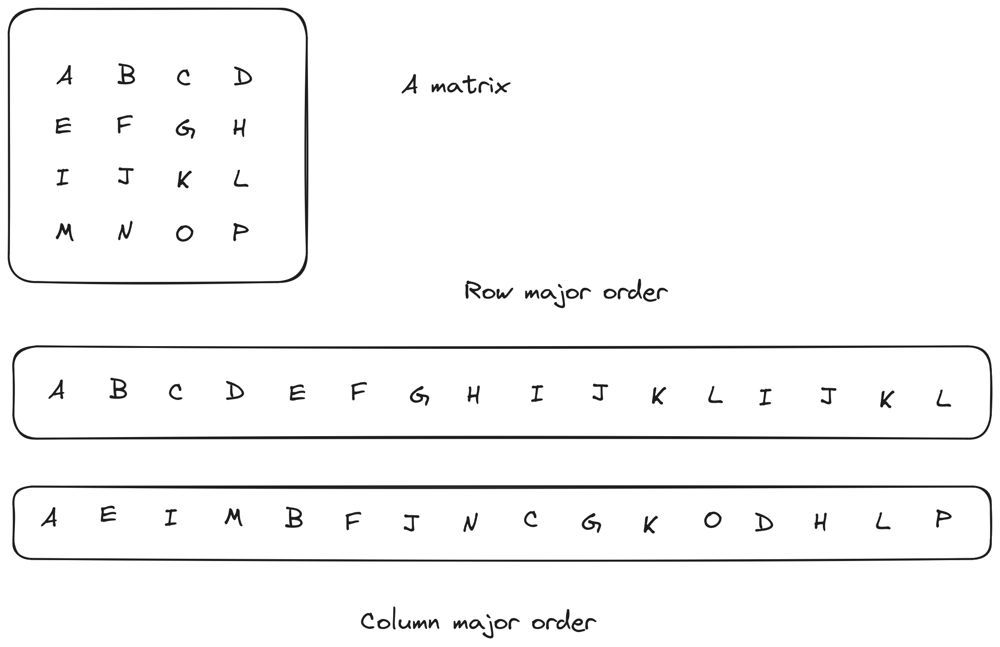

Compilers
---------

A compiler is a program that takes a program in a high level language such as C,
Fortran, or Haskell, and translates it to a lower level target language. In most
cases, the target language is some form of *assembly language*; a textual 
representation of the machine code of some family of computers. Meanwhile,
interpreted languages (e.g. Python, JavaScript) have their code translated to
machine code *during* runtime.

Compilation generally proceeds in a number of steps and even though details vary,
the general sequence is as follows:

1. Lexical analysis and parsing. The characters in the input file are first
   grouped into *lexical tokens* which are the word sized units of the language.
   Examples include numbers (integral and fractional), identifiers such as variable
   names and special symbols like "+" or (in C) "{".
   
   Parsing groups these further into "sentences" in accordance with the grammar
   of the language. The result of parsing is often called an *abstract syntax tree*
   and it is a data structure that allows the rest of the compiler easy access to
   the structure of the program. It answers questions like "what is the first
   statement in this function" or "what is the condition part of this if-statement".

2. Semantic analysis. Here we find out whether different pieces of the program fit
   together, for instance that all variables are declared before they are used (if
   the language mandates that) and that the declarations fit with their use so 
   that a floating point number is not used as a pointer.

3. High level optimization. In this phase, the compiler tries to rewrite the
   program to a more efficient one. There are many such optimizations and this
   is a major focus of this part of the performance engineering workshop.
   
   In general, this part consists of analysis steps, that establish whether a
   certain change to the code is legal or not, transformation steps that change
   the program, and translation (often called *lowering*) steps that translates
   from one representation of the program to another.

4. Code generation. Here a final translation is made to a representation that is
   close to the target machine. While the previous representations are fairly 
   generic and look the same whether we are compiling for an ARM or (some version
   of) an x86, here we tackle the details of the machine, trying to exploit its
   stregths and work around its weaknesses.

5. Low level optimization. Here we try to improve the machine dependent aspects of
   the code, perhaps applying transformations that would not make sense on a 
   different machine.

Not surprisingly, this is a simplified account, although the first two steps are
quite accurate. One particular complication is that machine dependencies seep
upwards to earlier steps. Not that the high level optimizer necessarily contains 
code specialized for a particular target, but it may consult tables giving overall
information about a machine that can guide the optimizer in whether or how to 
apply certain optimizations.

Conversely, the last steps may run exactly the same code for an ARM and an x86 but
use different machine description tables.

.. Intermediate representations

Lowering
========

Translation from one intermediate representation (IR) to the next one is often 
referred to as *lowering* since each IR has a lower level of abstraction than
the previous one. Here we will discuss the lowering of a few high level language
constructs.

Arrays
""""""

A computer memory is a linear sequence of memory locations, each with its own
address. Memory is in this sense similar to an array, and it is straight forward
to implement a one dimensional array as a block of memory large enough to contain
all of the elements of the array. In C, the first element has index 0, wheras in
Fortran, the first element has index 1.

.. list-table:: Array layout (C style)
   :widths: 10 10
   :header-rows: 1
   
   * - Index
     - Address
   * - 0
     - :math:`B`
   * - 1
     - :math:`B + E`
   * - 2
     - :math:`B + 2E`
   * - ...
     - ...
   * - :math:`N-1`
     - :math:`B + (N-1)E`


.. list-table:: Array layout (Fortran style)
   :widths: 10 10
   :header-rows: 1
   
   * - Index
     - Address
   * - 1
     - :math:`B`
   * - 2
     - :math:`B + E`
   * - 3
     - :math:`B + 2E`
   * - ...
     - ...
   * - :math:`N`
     - :math:`B + (N-1)E`

Here the array starts at address :math:`B` and each element is :math:`E` bytes
in size (if, as is the case for most machines today, each memory adress corresponds
to one byte). With this layout, it is easy to figure out where element :math:`i` is
stored; we can find it at address :math:`B+iE`.

.. exercise::

   Where do we find the element with index :math:`i` in a one dimensional Fortran
   array stored in memory at address :math:`B`?

.. solution::

   Fortran uses 1-based indexing, so the first element has index one. Thus the
   correct expression is :math:`B + (i-1)E`.

We can typically keep track of the array in memory by keeping track of where it
starts. The size of each element depends on the element type of the array, which
is statically known.

.. tip::

   Something is *statically known* if the compiler knows it: There is no
   need to run the program to figure it out. In languages such as C and Fortran
   that are *statically typed*, types are always statically known.

For multidimensional arrays, things are somewhat trickier. In order to be able
to find elements efficiently based on their indices, the layout must be regular.
The two most common layouts are *row major* and *column major* and as luck would
have it, C and Fortran are different in this respect. Well, Fortran is different.
Almost all other languages feature row major layout like C. Here is what the
two layouts look like:



   Multidimensional arrays: row major vs column major layout


For the C layout, we find element :math:`(i,j)` of an array with starting address 
:math:`B` at :math:`B + (iC + j)E` where :math:`C` is the row length (number of 
columns) and :math:`E` as usual is the element size.

.. exercise::

   Where do we find the element with index :math:`(i,j)` in a two dimensional Fortran
   array stored in memory at address :math:`B`?

.. solution::

   We have two differences from C: The 1-based indexing and the column major
   layout. Taking both into account we find our element at
   :math:`B + ((i-1) + (j-1)R)E` where :math:`R` is the column length (number
   of rows) and :math:`E` is the element size.

Now, for the one-dimensional case we only needed the base address and the element
size, but now we also need either the row (for a row major layout) or column
(for a column major) length. The latter is not necessarily statically known; it
will in general depend on input data. And when we write library code, it is not
acceptable to have the library routine work with a single size only.

In Fortran, we can tell the compiler the size of the array in all of its dimensions.
That size can be a not statically known expression, for instance a function
argument. In C we are not so lucky; we only have multi dimensional arrays with 
static row length.

Fortunately, we can always manufacture our own multidimensional arrays from 
single dimensional ones, but then we will have to write the corresponding
expression in our programs. We will see quite a lot of that later.

.. tip:: 

   The term "optimization" does not mean the same thing in compiler technology
   as in, well, optimization. In the present context, there are in general no
   well defined objective functions; we want the code to "run faster" on whatever
   machine we have available.
   
   There is thus also no guarantees of optimality; a compiler only promises to do
   its best. New compiler versions might generate better code. Even where there
   are sub problems that have well defined objectives, nonoptimal heuristics are
   often used to make the compiler run faster.


High level optimization
=======================

This are includes a lot of different techniques that are roughly concerned with

- not doing things,

- doing things fewer times, and

- doing cheaper things.

We will illustrate some of these techniques as rewrites of C code, something that
is possible since, for being a high level language, C is rather low level. In
particular, the design of pointers in C allows for considerable freedom in their
use.

.. admonition:: Why is this relevant?
  Many of the techniques displayed here are performed automatically in compilers.
  For example, GCC has the optimization flags ``-O0`` (no optimization) to ``-O3```
  (aggressive optimization) that will do everything automatically.

  So, why is this important? There might be many situations where you want to be
  in control of what the compiler is doing, especially in codes that are to be 
  deployed in sensitive environments (e.g., production).

Constant folding
""""""""""""""""

Sometimes code contains constant expressions like ``16*1024`` which one might
write because they are more evidently 16K than the more error prone ``16384``.
And do not even think about writing ``536870912`` rather than ``512*1024*1024``.
Also, it may well be that the source code contained

.. code-block:: C

   #define K 1024
   #define M K*K

and then we had ``16*K`` and ``512*M`` at various places.

Fortunately, the compiler will evaluate all such expressions at compile time.

Copy propagation
""""""""""""""""

Sometimes, we find statements just doing copies in our code. More often, there are
previous optimizations that have created these copies, which might enable these
optimizations to be simpler to implement. So if we have for instance

.. code-block:: C

   x = y;
   return x;

copy propagation will transform this to

.. code-block:: C

   x = y;
   return y;

and since nothing ever happens after a ``return``, *dead code elimination*
will take care of the now useless copy and give us

.. code-block:: C

   return y;

as expected. Again, we see examples of breaking down optimizations into many
small steps. The reason is that some other transformation might have created
a dead copy, so it's better to remove all of them at one place in the compiler
rather than having both the copy propagator and other optimizations all worry
about assignments to dead variables (a variable is *dead* at a point in the
program if it will certainly not be read before it is assigned to again).

Both constant folding and copy propagation are examples of "not doing something".

Common subexpression elimination
""""""""""""""""""""""""""""""""

Sometimes, the same expression occurs twice, as in

.. code-block:: C

   n = (m+1) * (m+1);

which can be rewritten to

.. code-block:: C

   int t = m+1;
   n = t * t;

where ``t`` is a new variable with the same type as
``m+1`` (which in this case is the same type as
``m``). On the other hand, if we have

.. code-block:: C
   :linenos:

   n = m+1;
   m = a+3;
   k = m+1;

then clearly there are no common subexpressions. The occurrence of ``m+1``
on line 1 does not have the same value as ``m+1`` on line 3 since the value
of ``m`` has potentially changed in between.
This was a very obvious case, but consider the following:

.. code-block:: C
   :linenos:

   a[i  ] = a[j]+1;
   a[i+1] = a[j]+1;

Here it depends on whether ``i == j``; in that case the write to
``a[i]`` on line 1 will affect the read of
``a[j]`` on line 2.

In this case the question hinges on the values of two integer variables while
in other cases it might be a question of whether two arrays (pointers) are the
same or not:

.. code-block:: C
   :linenos:

   a[i+1] = b[i]+1;
   a[i+2] = b[i]+1;

Here, the indices are clearly different, but can the compiler be sure that ``a``
and ``b`` do not overlap?

The compiler attempts to answer these questions using *alias analysis*. The name
comes from the *alias problem*: Is ``a[i+1]`` another name (an alias) for
the same memory location as ``b[i]``?

Here we got our first example of "doing something fewer times".


Loop invariant removal
""""""""""""""""""""""

It is a relatively safe bet that loops will iterate; moving a computation outside
a loop will almost always save work. Here is a small example:

.. code-block:: C

   for(int i = 0; i < n; i++) {
     a[i] = m+1;
   }

We can clearly do the addition before the loop instead (here we assume that ``m+1``
is an ``int``):

.. code-block:: C

   int t = m+1;
   for(int i = 0; i < n; i++) {
     a[i] = t;
   }

Perhaps not all that impressive, but useful. One particularly rich source of loop
invariant computations is array index computations. This is especially true of
index computations for multi dimensional arrays. Consider the following C code
where the mapping of the two dimensional array to a one dimensional array has been 
made explicit:

.. code-block:: C

   void add(double *a, double *b, int m, int n) {
     for( int i = 0; i < m; i++ ) {
       for( int j = 0; j < n; j++ ) {
         a[i*n + j] += b[j];
       }
     }
   }

.. Since this code is C, it uses the array semantics of the C language which leaves 
   the multiplication with the size of the array element type to the compiler. For
   the purpose of this discussion

We see that the ``i*n`` expression is invariant in the inner loop, so we can 
move it out:

.. code-block:: C

   void add(double *a, double *b, int m, int n) {
     for( int i = 0; i < m; i++ ) {
       int t = i*n;
       for( int j = 0; j < n; j++ ) {
         a[t + j] += b[j];
       }
     }
   }

Now, something that is not immediately obvious is that there is a loop invariant
add involved in the array access, so we can actually rewrite the code to:

.. code-block:: C

   void add(double *a, double *b, int m, int n) {
     for( int i = 0; i < m; i++ ) {
       int t = i*n;
       double *c = a + t;
       for( int j = 0; j < n; j++ ) {
         c[j] += b[j];
       }
     }
   }

By the rules of pointer arithmetic in C, when a pointer and an integer is added,
the integer is implicitly multiplied by the size of the kind of thing the pointer
points at and the type of the result becomes the type of the pointer. So ``a + t``
becomes a pointer to a double, ``double *``, that points exactly to where
``a[t]`` is stored in memory.


Strength reduction
""""""""""""""""""

Sometimes, it is possible to replace an expensive operation with a cheaper one.
For instance, multiplication with a power of two, for instance ``i*16`` can be
replaced by a shift; ``i << 4``. For nonnegative numbers, division by a power 
of two can likewise be replaced by a right shift.

However, strength reduction is also used in loops where it can be used to target 
the multiplication by the size of the element type part of array access. Taking
the ``add`` function from the previous subsection as an example again:

.. code-block:: C

   void add(double *a, double *b, int m, int n) {
     for( int i = 0; i < m; i++ ) {
       int t = i*n;
       double *c = a + t;
       for( int j = 0; j < n; j++ ) {
         c[j] += b[j];
       }
     }
   }

Here, we want to avoid the multiplications by ``sizeof(double)`` implicit in 
the array accesses:

.. code-block:: C

   void add(double *a, double *b, int m, int n) {
     for( int i = 0; i < m; i++ ) {
       int t = i*n;
       double *cc = a + t;
       double *bb = b;
       for( int j = 0; j < n; j++ ) {
         *cc += *bb;
         cc++;
         bb++;
       }
     }
   }

This is in fact not the only way to do it. If we for the moment step outside of C
and write ``a[[i]]`` to mean an array access *without* the implicit multiplication
by the size of the array elements we can write the ``add`` function (before strength
reduction) as:

.. code-block:: C

   void add(double *a, double *b, int m, int n) {
     for( int i = 0; i < m; i++ ) {
       int t = i*n;
       double *c = a + t;
       for( int j = 0; j < n; j++ ) {
         c[[j*8]] += b[[j*8]];
       }
     }
   }

We can now simply strength reduce the ``j*8`` expression:

.. code-block:: C

   void add(double *a, double *b, int m, int n) {
     for( int i = 0; i < m; i++ ) {
       int t = i*n;
       double *c = a + t;
       int k = 0;
       for( int j = 0; j < n; j++ ) {
         c[[k]] += b[[k]];
         k += 8;
       }
     }
   }

We have replaced the multiplication with an addition (and we also happened to 
do a bit of common subexpression elimination as well).

These two versions of strength reduction of the ``add`` function exemplifies
the point made above that machine dependent considerations enter also in high
level optimizations. Some architectures, like ARM, have memory reference
instructions that can update the base register with the sum of the old base
register and a constant. Thus the first version of the ``add`` function would
be best since the two pointer updates would be free.

If we instead have a target like the x86 where it is cheap, or even free, to
form a memory address by adding two registers, the second form might be 
preferable (and we will see it later when looking at the code GCC generates for
matrix multiplication for the x86 target).

But is it not something we have forgotten? Yes, we only did apply strength 
reduction to the innermost loop. We also have the ``i*n`` to deal with. Here
is the final version, geared towards the x86:

.. code-block:: C

   void add(double *a, double *b, int m, int n) {
     int u = 0;
     int s = n << 3;                  // Loop invariant removal and strength reduction of *8
     for( int i = 0; i < m; i++ ) {
       double *c = a [+] u;           // No implicit multiplication
       u += s;
       int k = 0;
       for( int j = 0; j < n; j++ ) {
         c[[k]] += b[[k]];
         k += 8;
       }
     }
   }

Here, we have used ``[+]`` to indicate a pure add with no implicit multiplication.
Instead, we do the multiplication outside the loop and also strength reduce it to
a shift.

Induction variable elimination
""""""""""""""""""""""""""""""

Let us have a look at the innermost loop in the latest version of the ``add``
function:

.. code-block:: C

    for( int j = 0; j < n; j++ ) {
      c[[k]] += b[[k]];
      k += 8;
    }

The induction variable ``j`` is now used only for the loop control. Could we do
the loop control in another way? Yes, because the variable ``k`` moves in lock-step
with ``j``. After all, we introduced it to strength reduce the expression
``j*8``. Hence we can rewrite the termination test in terms of 
``k`` and ``n*8`` which we conveniently have available as
``s`` (technically, that is a case of common subexpresssion evaluation, I think).

We can eliminate the outer index variable ``i`` as well since it is not used for
anything but loop control either. This leaves us with the following code 
for ``add``:

.. code-block:: C

   void add(double *a, double *b, int m, int n) {
     int u = 0;
     int s = n << 3;                  // Loop invariant removal and strength reduction of *8
     int v = s*m;                     // u was always i*s, so i < m becomes u < s*m
     while( u < v ) {
       double *c = a [+] u;           // No implicit multiplication
       u += s;
       int k = 0;
       while( k < s ) {
         c[[k]] += b[[k]];
         k += 8;
       }
     }
   }

We have now eliminated the induction variables and their updates.

Exit controlled loops
"""""""""""""""""""""

Loops are translated to code containing conditional and unconditional branches,
which have their equivalent in the C ``goto`` statement which transfers control
to a label. **You should never ever write goto statements in your code.** If you
ever feel tempted, read Edsger Dijkstras famous letter `"Goto statements considered
harmful" <https://homepages.cwi.nl/~storm/teaching/reader/Dijkstra68.pdf>`_.

However, we can use them to illustrate how one would generate code for an entry
controlled loop such as a ``while``:

.. code-block:: C

   while( c ) {
     ...
   }

A straight forward translation of this would be something like:

.. code-block:: C

   top:
     if( !c ) goto bot;
     ...
     goto top;
   bot:

Contrast this with an exit controlled loop such as a ``do`` in C:

.. code-block:: C

   do {
     ...
   } while( c );

This will be translated to something like:

.. code-block:: C

   top:
     ...
   if( c ) goto top;

This is clearly better. But of course the two loops have different semantics. We
have to wrap the ``do`` loop in an ``if`` statement got get exactly the same
behaviour.

If we apply this to our strength reduced and induction variable eliminated ``add``
function we get:


.. code-block:: C

   void add(double *a, double *b, int m, int n) {
     if( m > 0 ) {
       int u = 0;
       int s = n << 3;                  // Loop invariant removal and strength reduction of *8
       int v = s*m;                     // u was always i*s, so i < m becomes u < s*m
       do {
         double *c = a [+] u;           // No implicit multiplication
         u += s;
         if( n > 0 ) {
           int k = 0;
           do {
             c[[k]] += b[[k]];
             k += 8;
           } while( k < s );
         }
       } while( u < v );
     }
   }

We have now finally arrived at the basic code structure that we would see
rendered in assembly as compiler output.


Unreachable code elimination
""""""""""""""""""""""""""""
Unreachable code, which is never executed in the program, should also be eliminated as
it serves for nothing other than occupy memory space. A typical example is
code that is written after a return statement. In the example below, whatever is
written after ``return c`` will not ever be executed, therefore the two last lines
may be removed.

.. code-block:: C
  int global; 

  int foo(void) {
  int i;
  i = 1;
  global = 1; 
  global = 2;
  return;
  global = 3;
  return 0;
}

The code can be enhanced even further by noticing that only the last value of ``global`` is
the only one that matters before the function returns. In similar way, ``i`` is not used in the
scope of that function and therefore can be removed as well.

.. code-block:: C
  int global; 

  int foo(void) {
  global = 2;
  return;
}

While the examples above are relatively trivial, elimination of unreachable code, especially when automatically done
by the compiler, can be especially relevant in large code bases where it is not necessarily obvious that the code will not be 
executed due to where it is placed.

Inlining
"""""""""
Another optimization commonly desired is to avoid the overhead of function calls. This overhead is associated to the process of saving
the caller state (registers, return address), pushing arguments and stacks or into registers, branching to the function address, and then
returning. Functions that are called with very high-frequency, or ones that perform trivial operations are good candidates to be inlined. 

In practice, what we do is to replace the function code directly into the main code if possible.

.. code-block:: C
  int clamp(int x, int min, int max) {
      if (x < min) return min;
      if (x > max) return max;
      return x;
  }

  void process(int* data, int size) {
      for (int i = 0; i < size; i++) {
          data[i] = clamp(data[i], 0, 100);
      }
  }

In the example above, the function ``clamp`` is called several times. It is a good candidate for inlining as it is small, simple,
and the arguments are often constants (i.e., one can fold constants and eliminate unecessary comparisons). Therefore, the function
``process`` may be rewritten as follows.

.. code-block:: C
  void process(int* data, int size) {
      for (int i = 0; i < size; i++) {
          int x = data[i];
          if (x < 0) x = 0;
          else if (x > 100) x = 100;
          data[i] = x;
      }
  }

One may tip the compilers by using the ``inline`` keyword on the function header. It is also possible to optimize even more the 
previous example through the usage of ternary operators and therefore avoid more branching.

Further reads
^^^^^^^^^^^^^^^

- Robert Nystrom. "Crafting Interpreters", 1st Edition. Genever Benning. 2021.
- Keith Cooper and Linda Torczon. "Engineering a Compiler", 3rd Edition. MK Publishers. 2025.
